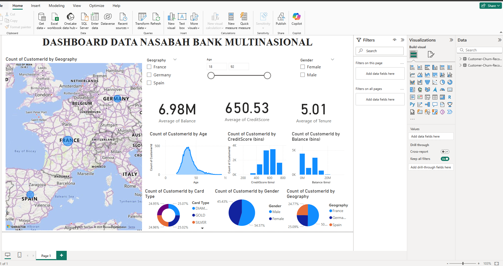

## **📊 Dashboard Data Nasabah Bank Multinasional**  

### **📌 Deskripsi**  
Dashboard ini dibuat menggunakan **Microsoft Power BI** untuk menganalisis data nasabah dari berbagai negara. Dashboard ini menyediakan visualisasi interaktif mengenai karakteristik nasabah berdasarkan **lokasi geografis, umur, skor kredit, saldo rekening, jenis kartu, serta distribusi gender**.  

---

### **📷 Preview Dashboard**  
  

---

### **📂 File dalam Repository**  
- **`BANK_DASHBOARD.pbix`** → File utama Power BI yang berisi visualisasi dan data.  
- **`README.md`** → Dokumentasi proyek.  
- **`image.png`** → Cuplikan layar (screenshot) dashboard.  

---

### **📊 Fitur Dashboard**  
✅ **Peta Interaktif** → Menampilkan jumlah nasabah berdasarkan negara (France, Germany, Spain).  
✅ **Statistik Kunci**:  
   - Rata-rata saldo rekening nasabah  
   - Rata-rata skor kredit  
   - Rata-rata masa aktif nasabah  
✅ **Visualisasi Data**:  
   - Histogram skor kredit dan saldo rekening  
   - Distribusi umur nasabah  
   - Jenis kartu yang digunakan  
   - Persentase nasabah berdasarkan gender  
✅ **Filter Interaktif**:  
   - Filter berdasarkan negara  
   - Filter berdasarkan rentang umur  
   - Filter berdasarkan gender  

---

### **📥 Cara Menggunakan**  
1. **Unduh file Power BI (`.pbix`)** dari repository ini.  
2. **Buka dengan Microsoft Power BI Desktop**.  

---

### **📌 Teknologi yang Digunakan**  
- **Microsoft Power BI** (Visualisasi Data)  
- **DAX (Data Analysis Expressions)** untuk perhitungan metrik tambahan  

---
